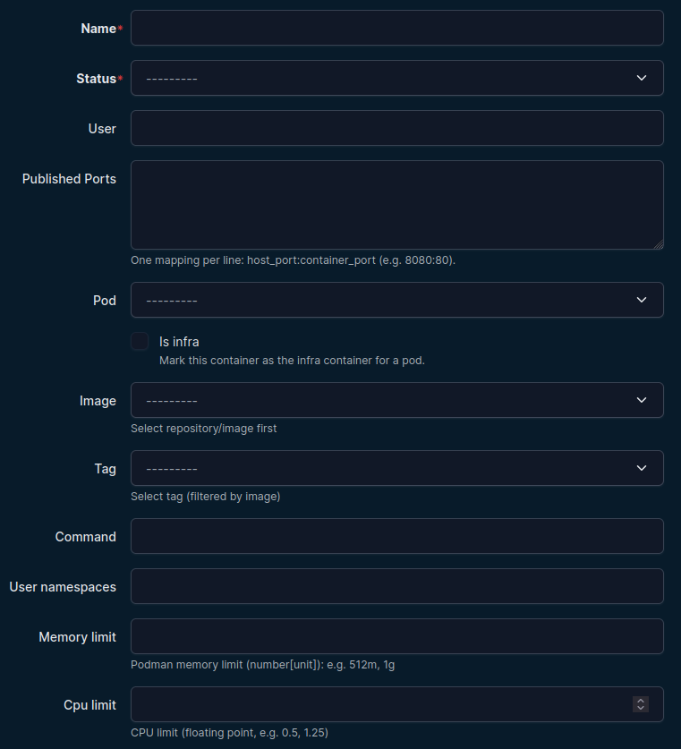
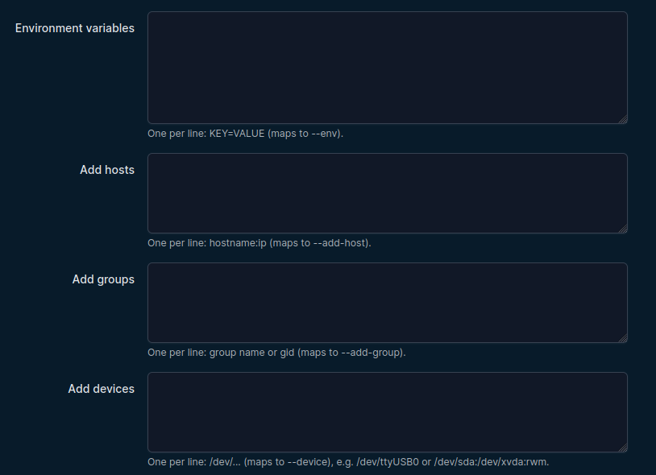
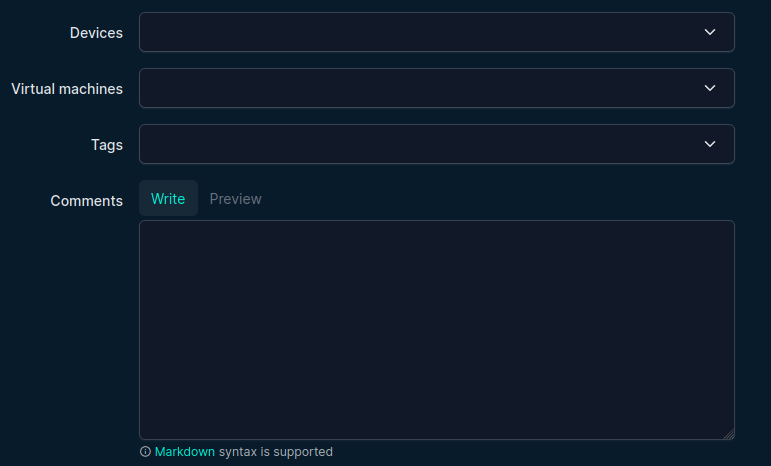
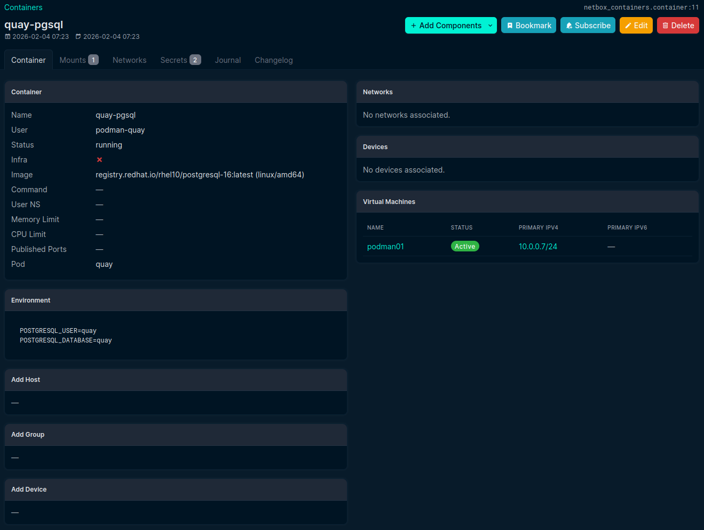
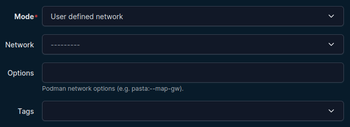
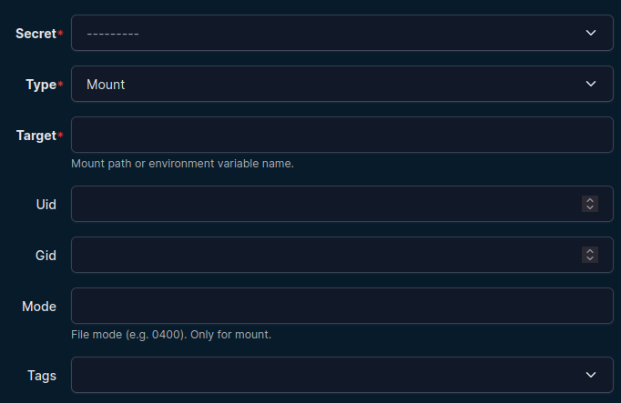

# Containers

Containers are the primary runtime objects.

## Create a container

Go to **Containers -> Containers -> Add**.

Core fields:

- Name (required)
- Status
- User
- Pod (optional, Podman pods only)
- Is infra (Podman pods only)
- Image and image tag
- Command
- User namespaces
- Memory limit
- CPU limit

 

Runtime option fields (multi-line, one entry per line):

- Published ports (`host:container`)
- Environment variables (`KEY=VALUE`)
- Add hosts (`hostname:ip`)
- Add groups (`group` or `gid`)
- Add devices (`/dev/...`, maps to `--device`)

 

Relationship fields:

- Devices (NetBox DCIM devices)
- Virtual machines
- Tags
- Comments

 

## Container detail page

The detail page shows:

- Core metadata and status
- Infra indicator
- Runtime option panels (env/add-host/add-group/add-device)
- Associated devices/VMs
- Child components via tabs and Add Components menu

 

## Container child components

### Mounts

Define mount mappings for the container:

- Mount type (bind or named volume)
- Volume or host path
- Destination path
- Mount options

 

### Networks

Attach network configuration with either:

- User defined network object, or
- Mode/custom options (for runtime network modes)

Podman-specific notes:

- Podman supports additional network mode/options patterns (for example `private`, `pasta:...`, `slirp4netns:...`).
- Docker compatibility for custom network option strings depends on engine/runtime support.

 

### Secrets

Attach predefined secrets to a container:

- Secret (required)
- Type (`mount` or `env`)
- Target (required)
- UID/GID/Mode (mount-only)

 

## Infra container behavior

If **Is infra** is enabled and the container is assigned to a pod, it can be selected as the pod infra container.

This workflow is Podman-specific (Docker does not provide Podman-style pods/infra containers).
