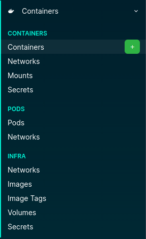

# NetBox Containers Plugin

This plugin extends NetBox to document container workloads and their related runtime objects.

## Scope

The plugin focuses on documenting container runtime configuration (Podman/Docker-style) in NetBox:

- Containers
- Pods
- Networks and network attachments
- Mounts
- Secrets
- Images and image tags
- Volumes

See it in action:

## Compatibility notes (Podman vs Docker)

- **Pods** and **infra containers** are Podman-only concepts.
- **Secret drivers** `file`, `pass`, and `shell` are Podman-specific.
- Some network mode/custom options are Podman-specific (for example `private`, `pasta`, `slirp4netns`).
- Core container fields (image/tag, env, add-host, mounts, ports, volumes, basic networks) are generally usable for both Podman and Docker documentation.

> WARNING: This plugin is under active development. Do not use it for production workloads yet.

## Object model

- A **Container** can belong to one **Pod**.
- A **Container** can have multiple:
  - Mounts
  - Network attachments
  - Secret attachments
- A **Pod** can have multiple:
  - Containers
  - Network attachments
  - One selected infra container
- **Infra** objects (Networks, Volumes, Secrets, Images, Image Tags) are reusable inventory objects.

## UI overview

Navigation is grouped into three sections:

- **Containers**: Containers, container networks, container mounts, container secrets
- **Pods**: Pods, pod networks
- **Infra**: Networks, Images, Image Tags, Volumes, Secrets

 

## Next steps

- Install and enable the plugin: [Installation](installation.md)
- Understand menu layout: [Navigation](navigation.md)
- Start with the core object: [Containers](containers.md)
