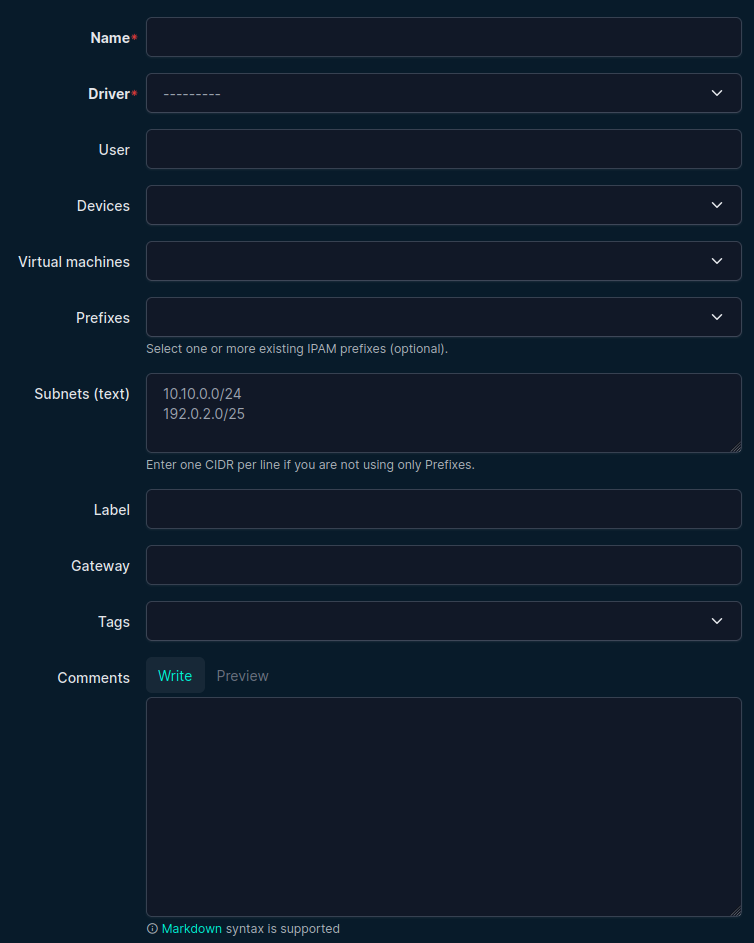
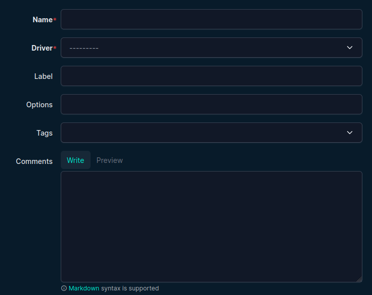
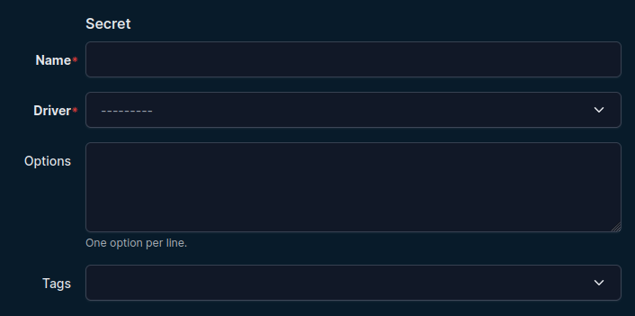
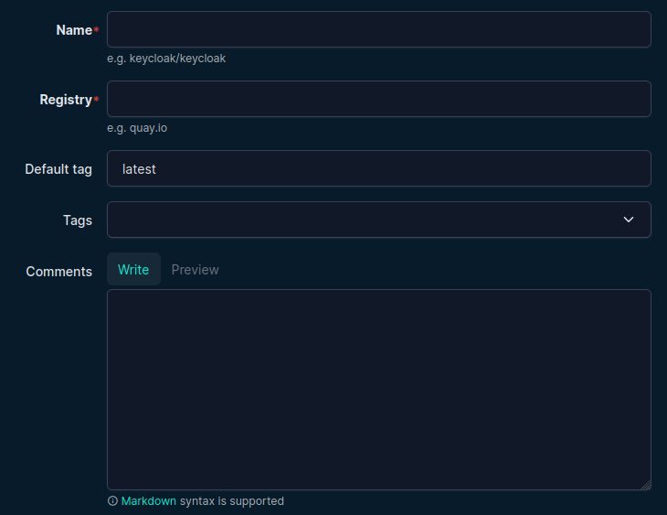
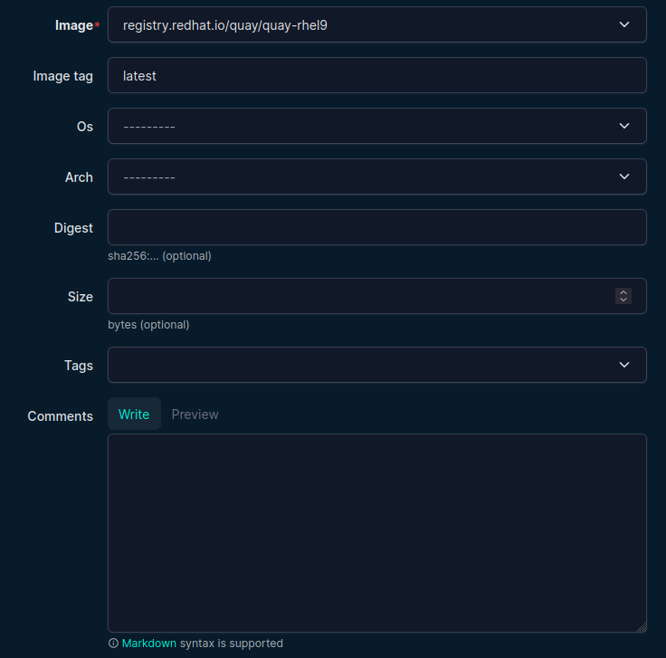

# Infra Objects

Infra objects are reusable definitions used by containers and pods.

## Networks

Location: **Infra -> Networks**

Use for predefined runtime networks (for example Podman user-defined networks).

Compatibility note:

- Network objects are reusable for both Podman and Docker style documentation.
- Some attachment modes/options used with these networks are Podman-specific.

Typical fields include:

- Name
- Driver
- Subnet/gateway (if modeled)
- Additional options

## Volumes

Location: **Infra -> Volumes**

Reusable named volumes referenced by container mounts.

## Secrets

Location: **Infra -> Secrets**

Reusable secret definitions.

Fields:

- Name
- Driver (`file`, `pass`, `shell`) (Podman-specific)
- Custom options (multi-line text, one option per line)

The secret drivers above map to Podman secret drivers. Docker secret handling differs.

## Images and Image Tags

Locations:

- **Infra -> Images**
- **Infra -> Image Tags**

Images represent repositories/namespaces. Tags are linked to images and selected in container forms.

