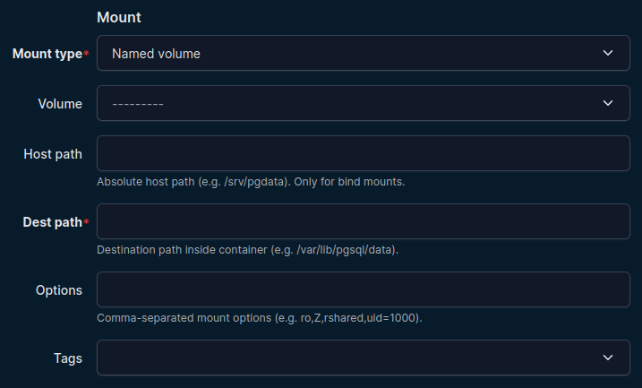

# Navigation

The plugin menu is split by operational area.

## Containers section

- **Containers**: all container objects
- **Networks**: all container network attachments
- **Mounts**: all container mounts
- **Secrets**: all container secret attachments

## Pods section

- **Pods**: all pod objects (Podman only)
- **Networks**: all pod network attachments (Podman only)

## Infra section

- **Networks**: reusable network definitions
- **Images**: container image repositories
- **Image Tags**: tags belonging to images
- **Volumes**: reusable named volumes
- **Secrets**: reusable secret definitions

## Detail pages and component tabs

On object detail pages (for example Container and Pod), use **Add Components** to create child objects directly in context.

Example flows:

- Container -> Add Components -> Mounts
- Container -> Add Components -> Networks
- Container -> Add Components -> Secrets
- Pod -> Add Components -> Networks

