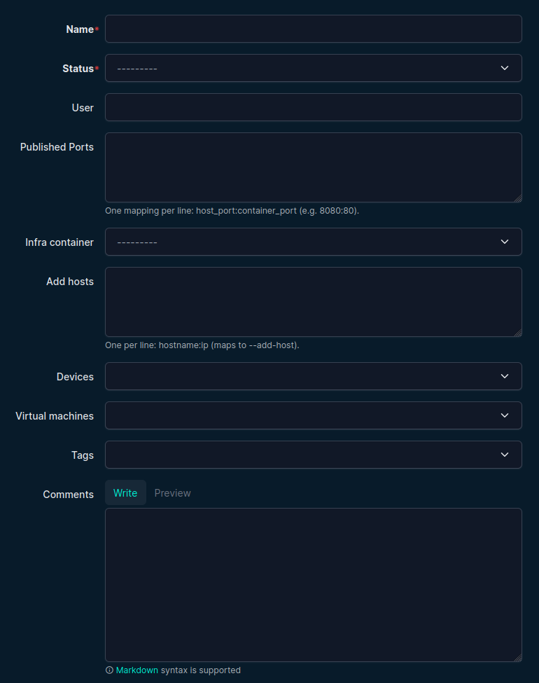
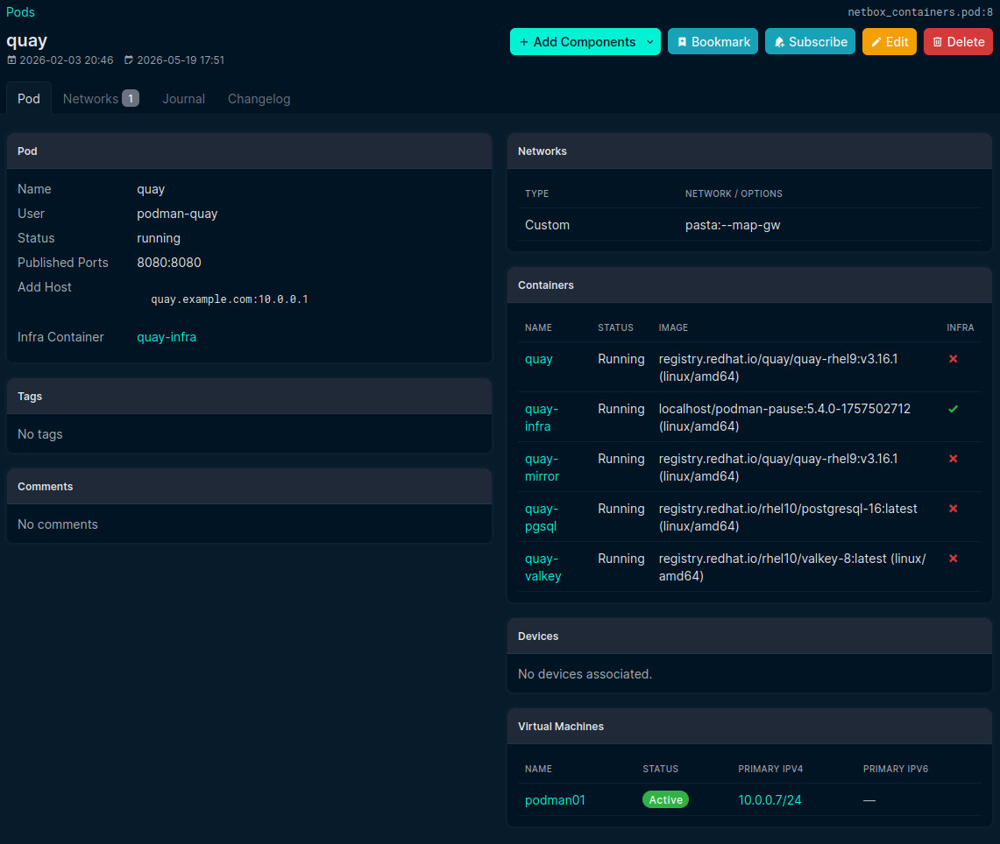
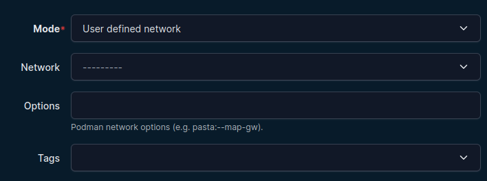

# Pods (Podman Only)

Pods group multiple containers with shared runtime context.

Docker users: this section does not apply because Docker has no native Podman-style pod object.

## Create a pod

Go to **Pods -> Pods -> Add**.

Typical fields:

- Name (required)
- Status
- User
- Published ports (multi-line)
- Add hosts (multi-line)
- Infra container
- Devices / Virtual machines
- Tags / Comments

## Infra container selection

Infra container choices are filtered to containers that:

1. Have **Is infra** enabled
2. Belong to the current pod

This prevents selecting infra containers from other pods.

## Pod detail page

The detail page shows:

- Pod metadata
- Selected infra container
- Container table (including infra indicator)
- Network attachments

## Pod networks

From a pod detail page, use **Add Components -> Networks**.

Each pod network attachment can reference:

- A reusable network, or
- A runtime mode/custom value

